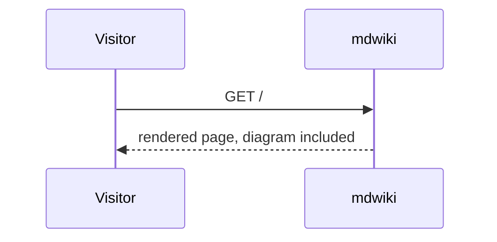

# Example Wiki

This is mdwiki's example site — used for smoke-testing and as the
getting-started guide's worked example.

- [Lessons](/lessons/)

Try the built-in `toast` widget directly, right here on the homepage:

{{ widget: toast title="Heads up" text="This toast is rendered by the standard widget set, shipped with mdwiki itself." style="info" }}

Plain ```mermaid fences render as diagrams by default - no widget needed:


